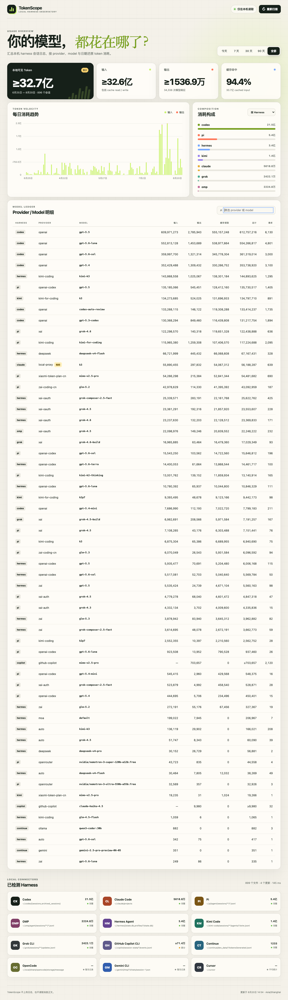

# TokenScope

TokenScope 是一个本地优先的 AI coding harness token 用量仪表盘。它扫描本机已有会话日志，统一为 provider / model / harness / date 四个维度，并清楚区分完整统计、部分可见与无法从本地获得的数据。首页的 Token 活动热力图以类似 GitHub 贡献图的方式展示过去 12 个月每天的使用量。



## 运行

要求 Node.js 20 或更高版本，无需安装第三方依赖。

```bash
npm start
```

然后访问 [http://127.0.0.1:4317](http://127.0.0.1:4317)。服务只监听 loopback，不接受局域网连接。

也可以直接在终端查看统计：

```bash
npm run scan -- --range=30d
npm run scan -- --range=all --json
```

可用时间范围为 `today`、`7d`、`30d`、`90d` 和 `all`。

## 当前支持

| Harness | 本地来源 | 覆盖情况 |
|---|---|---|
| Codex | `~/.codex/sessions`、`~/.codex/archived_sessions` | 输入、输出、缓存读取/写入、推理；完整 |
| Claude Code | `~/.claude/projects/**/*.jsonl` | 输入、输出、缓存；完整。流式快照按 message id 去重 |
| Pi | `~/.pi/agent/sessions/**/*.jsonl` | assistant message 与 compaction 的 provider、model、输入、输出、缓存与推理；完整 |
| OMP / oh-my-pi | `~/.omp/agent/sessions/**/*.jsonl` | 主/子 agent 的 assistant 与 compaction usage；完整，忽略 orchestration 镜像 |
| Hermes Agent | `~/.hermes/state.db`、`~/.hermes/profiles/*/state.db` | 按 session/model/provider 聚合的输入、输出、缓存与推理；完整 |
| Kimi Code | `~/.kimi-code/sessions/**/agents/*/wire.jsonl` | 每个 agent 的逐次 usage.record；完整，忽略 context append 镜像 |
| Grok CLI | `~/.grok/sessions/**/updates.jsonl` | 按 prompt/model 的 turn-completed usage；完整，缓存已包含在 input 中 |
| GitHub Copilot CLI | `~/.copilot/session-state/*/events.jsonl` | 本地仅记录输出 token；部分 |
| Continue | `~/.continue/dev_data/*/tokensGenerated.jsonl` | prompt / generated token；完整 |
| OpenCode | JSON message storage | 输入、输出、缓存、推理；存在 JSON 会话时可用 |
| Gemini CLI | `~/.gemini/tmp/*/chats/session-*.json` | 会话保存 usage metadata 时可用 |
| Cursor / Aider | 安装目录 | 仅检测；未发现可靠的结构化本地 token 用量 |

Claude Code 的历史记录不直接保存 provider。TokenScope 会根据当前 Bedrock / Vertex / Foundry 开关或 `ANTHROPIC_BASE_URL` 的已知服务类型推断 provider；未知自定义域名统一显示为 `anthropic-compatible`，不会暴露域名。

## 统计口径

- “总计”是输入 token 加输出 token。
- 缓存读取是输入 token 的子集，不会再次加到总计里。
- Claude 的 API usage 把普通输入、cache creation 和 cache read 分开返回；TokenScope 会把三者合并为可比较的输入总量。
- Pi、OMP、Kimi Code 和 Hermes 把普通输入与缓存流量分开保存；TokenScope 会将 cache read/write 并入标准化输入，并继续把它们作为输入的子集展示。
- Grok CLI 和 Codex 的 input 已包含缓存流量，因此缓存只作为输入子集展示，不会再次相加。
- Codex usage 中 input 已包含 cached input，因此只做累计值差分，不重复相加。
- 推理 token 是输出 token 的子集，只单独保留用于后续扩展，不重复计入总计。
- 任何已选来源缺少本地字段时，总览显示“至少”和 `≥`。筛选到全部完整来源后会恢复为“精确”。
- 当前只统计 token，不根据模型价格推算费用，避免把历史价格变化和订阅制额度混为一谈。
- Hermes 的权威表按 session/model 聚合而不是逐次调用记录；每日趋势会把该组用量归到它的最后活动日。

## 隐私与索引

- 页面和 API 都在 `127.0.0.1` 上运行。
- 解析器只保留时间、harness、provider、model、token 数和不透明 session/message id；不保留 prompt、response、工具参数或工作目录。
- 增量索引写入 `.cache/usage-index.json`，权限为当前用户可读写。它按文件大小与修改时间复用结果；活跃会话变化时只重建对应文件。
- 点击“重新扫描”会重新检查文件指纹，但不会无意义地重读所有未变化的历史日志。

## 开发与验证

```bash
npm test
npm run check
```

测试覆盖累计 token 差分、Claude 流式去重、provider 推断、部分数据语义、日期范围、Harness 筛选、Token 活动热力图，以及十一种适配器的标准化格式。浏览器 QA 记录位于 [`dogfood-output/report.md`](dogfood-output/report.md)。

新增 harness 时，在 `src/adapters/` 中实现 `discover(homeDir)` 和 `parseFile(filePath, context)`，再注册到 `src/adapters/index.js`。所有适配器最终输出同一套 token record，聚合与 UI 无需感知原始日志格式。
