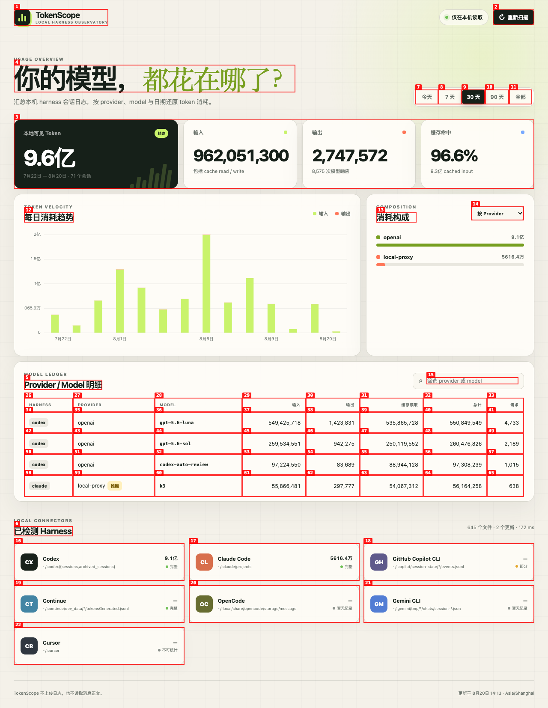
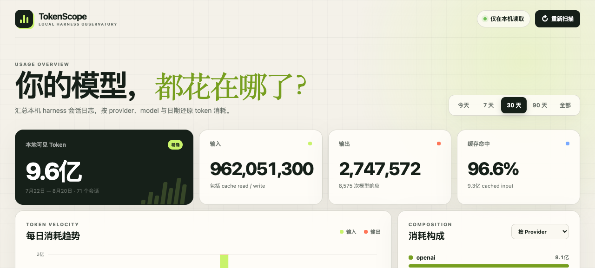
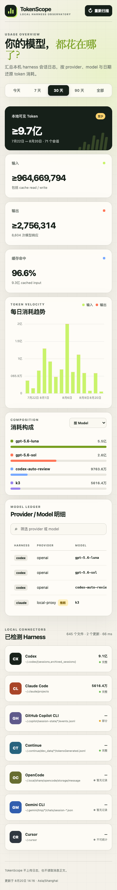

# Dogfood Report: TokenScope

| Field | Value |
|-------|-------|
| **Date** | 2026-08-20 |
| **App URL** | http://127.0.0.1:4317 |
| **Session** | tokenscope-qa-bb6d9c92cb25 |
| **Scope** | Full local dashboard: loading, ranges, filters, search, refresh, responsive layout, console and accessibility |

## Summary

| Severity | Count |
|----------|-------|
| Critical | 0 |
| High | 0 |
| Medium | 3 |
| Low | 0 |
| **Total** | **3** |

## Issues

### ISSUE-001: “精确”徽标忽略已选中的部分与不可统计来源

| Field | Value |
|-------|-------|
| **Severity** | medium |
| **Category** | functional / content |
| **URL** | http://127.0.0.1:4317/ |
| **Repro Video** | N/A（静态问题） |
| **Status** | Fixed and verified |

**Description**

总览显示“精确”，同时已选 Harness 中 GitHub Copilot 标为“部分”、Cursor 标为“不可统计”。总数只代表本地可见下限，因此徽标应为“至少”；只有筛选到全部具有完整 usage 的来源时才能显示“精确”。

**Repro Steps**

1. 打开仪表盘并保留默认的全部 Harness 选择，观察总览徽标与页面底部来源状态。
   

---

### ISSUE-002: 自动可访问性审计存在对比度与 ARIA 问题

| Field | Value |
|-------|-------|
| **Severity** | medium |
| **Category** | accessibility |
| **URL** | http://127.0.0.1:4317/ |
| **Repro Video** | N/A（静态问题） |
| **Status** | Fixed and verified |

**Description**

axe-core WCAG 2 A/AA 审计报告 1 个规则、4 个节点的明确失败：`#rangeCaption` 以及 Claude、Continue、Gemini 的来源图标文字对比度不足；同时 `range-control` 和 `chart-legend` 的通用容器带有不允许的 `aria-label`，需要补充适当 role。

**Repro Steps**

1. 打开仪表盘并运行 WCAG 2 A/AA 审计，观察总览次要文本与彩色 Harness 图标。
   

---

### ISSUE-003: 移动端横向明细表无法通过键盘聚焦

| Field | Value |
|-------|-------|
| **Severity** | medium |
| **Category** | accessibility / responsive |
| **URL** | http://127.0.0.1:4317/ （390 × 844） |
| **Repro Video** | N/A（静态问题） |
| **Status** | Fixed and verified |

**Description**

窄屏下 Provider / Model 表格会横向滚动，但滚动容器没有焦点入口。axe-core 报告 `scrollable-region-focusable` 失败，键盘用户无法进入区域并横向查看隐藏列。

**Repro Steps**

1. 将视口设为 390 × 844，滚动到 Provider / Model 明细区域并运行 WCAG 2 A/AA 审计。
   

---

## Final verification

- Desktop and 390 × 844 mobile layouts rendered without clipping or overlap.
- Date range, Harness toggles, provider/model breakdown, search and incremental refresh all completed successfully.
- Filtering out partial/unavailable sources changes the total from “至少” to “精确” as intended.
- Browser console and page error log were empty.
- Final axe-core WCAG 2 A/AA audit: **0 violations** on desktop and mobile. The remaining color-contrast entries are manual-review incompletes caused by the patterned/transparent page background, not detected failures.

---

## 2026-08-21 · Token Activity 热力图

新增 GitHub 风格的 “Token 活动” 面板：过去 53 周（按周一 对齐）逐日 token 用量热力图，色阶按当日用量相对全年峰值的平方根分档（level 0–4）。

**验证内容**

- 后端聚合：窗口固定为 53 周对齐，不受顶部时间范围（today/7d/30d/90d/all）影响，跟随 Harness 筛选切换（全部来源 121 天活跃 → 仅 Pi 108 天）。
- 单元测试：窗口边界（起始周一、末尾 future 天）、跨 harness 合并、部分数据 `complete: false` 与 `≥` 前缀、最长/当前连续天数、显式 harness 过滤，共新增 2 个用例（`npm run check` 16/16 通过）。
- 浏览器 QA（1512×945 与 390×844）：
  - 371 个单元格、12 个月份标签与列锚点像素级对齐（断点切换 12px↔10px 后由 ResizeObserver 重新定位，0 偏移）。
  - Tooltip：活跃日显示日期 + token + 请求数（不完整数据显示 `≥`），空日期显示 “无用量”，future 单元格不触发，网格 mouseleave / 内部滚动时隐藏，首行自动翻转到下方，左右边界钳制在容器内。
  - 移动端热力图在面板内横向滚动，页面无横向溢出；网格为 `role="img"` + 动态 aria-label，月份/星期标签对屏幕阅读器隐藏。
- 截图：`screenshots/token-activity-desktop.png`、`token-activity-tooltip.png`、`token-activity-mobile.png`。

---

## 2026-08-23 · 深色应用外壳：hash 路由 / 导航 / 统一时间范围（WADE-19）

单页应用重构为三个 hash 路由视图：总览（`#/`）、排行（`#/rank`）、下钻（`#/harness/:name`），共享深色主题外壳（`color-scheme: dark`，lime 主强调 / coral 输出），排行与下钻视图内容为占位（后续 WADE-20/21/22 实现）。

**验证内容**（agent-browser，1512×945）

- 路由：三个视图切换均为 hash 内切换（`window` 标记在导航后保留，证明无整页刷新）；浏览器后退/前进正确恢复视图与导航高亮。
- 重定向：`#/nonsense` → `#/`；`#/harness/` 与未知 harness（`#/harness/not-a-real-harness`）→ `#/rank`；畸形编码 `#/harness/%ZZ` 安全降级到 `#/rank`（不再抛 URIError）。
- 导航高亮：总览/排行按路由高亮；下钻视图高亮「排行」（主入口），`aria-current="page"` 同步。
- 时间范围：分段控件在三个视图均可触发重新取数（排行占位与下钻占位随 `7 天` 切换为 8月17日 — 8月23日），导航后选择保持（session 内持久）。
- 主题：`body` 背景 `rgb(10,13,16)`、暗色 `color-scheme`、激活分段按钮 `#c9f36b`；页面色板与设计稿一致（#101018 / #080810 主导）。
- `npm run check`：语法检查 + 49/49 测试通过。
- 截图：`screenshots/wade-19/overview-final.png`、`rank-placeholder.png`、`harness-drilldown-final.png`。

---

## 2026-08-23 · 总览视图（WADE-20）

`#/` 总览从旧单页迁入五个指标卡、每日趋势、构成切换、12 个月活动热力图，以及仅含复选框与用量的紧凑 Harness 块。模型明细表移出总览（留给排行）。缓存率在来源不完整时仍按可见输入正常显示。

**验证内容**（agent-browser）

- 五个指标卡从 `/api/usage` 实时渲染：Token / 输入 / 输出带 `≥`，「至少」标注，缓存率 `96.7%` 正常显示，请求带 `≥`。
- 构成 `按 Provider` / `Model` / `Harness` 分段切换不重新请求（`window.fetch` 计数保持 0；`window.__overviewProbe` 保持 1）。
- Harness 复选框取消 Cursor / Copilot / Droid / fx 后，「至少」变为「精确」，`≥` 前缀消失；再取消 Codex，总量从 17.2 亿变为 7.3 亿，构成首位变为 hermes。覆盖信息只出现在 tooltip。
- 热力图在「今天」范围下仍为过去 12 个月、371 格、12 个月份标签；范围文案变为「8月23日 — 8月23日」。
- axe-core WCAG 2 A/AA：0 violations。控制台无错误。
- `npm run check`：语法检查 + 49/49 测试通过。
- 截图：`screenshots/wade-20/overview-final.png`、`overview-final-full.png`、`composition-model.png`、`composition-harness.png`。

---

## 2026-08-23 · 排行视图（WADE-21）

`#/rank` 从占位升级为真实排行视图：视图内 Provider / Model / Harness 三分段切换重新排序（不路由、不刷新），行内展示名次、名称、相对榜首的份额条、用量与请求数；Model 行原地展开显示该模型在各 Harness 上的明细（来自既有 `groups` 数据）；Harness 行为链接直达 `#/harness/:name` 下钻（目的地仍为占位，待 WADE-23）。

**验证内容**（agent-browser，1512×945 与 390×844）

- 三分段切换重新渲染列表且 hash 保持 `#/rank`、`window` 标记保留（证明无整页刷新）；`aria-pressed` 与高亮同步；切换回 Model 后展开态按 tab 命名空间保留。
- 份额条按 `knownTokens / 榜首` 比例渲染（openai 100%、moonshot 27%、xai 24%、deepseek 6%）；Model 展开明细内的子条相对该模型内最大 Harness（Codex 100%、Hermes 2%、Pi 1%）。
- Model 行为原生 `<button>` + `aria-expanded`/`aria-controls`（指向真实明细节点），点击展开/收起焦点不丢失；明细行显示 Harness 显示名 + 用量 + 请求。
- 下界语义：来源覆盖不完整时（仅 Copilot + 全部范围）用量与请求均显示 `≥` 前缀（`≥71.4万` / `≥2,152`）；完整数据无前缀。
- Harness 行为 `<a href="#/harness/codex">` 等，显示名（Codex、Hermes Agent…）来自 `sources` 映射，点击进入下钻占位视图且导航高亮回到「排行」。
- 顶部时间范围在排行视图内切换（7 天）正常重取并重渲染，tab 选择保持；控制台无错误；390px 宽度无横向溢出。
- `npm run check`：语法检查 + 49/49 测试通过。
- 截图：`screenshots/wade-21/rank-provider.png`、`rank-model-expanded.png`、`rank-harness.png`、`rank-lower-bound.png`、`rank-model-expanded-mobile.png`。
